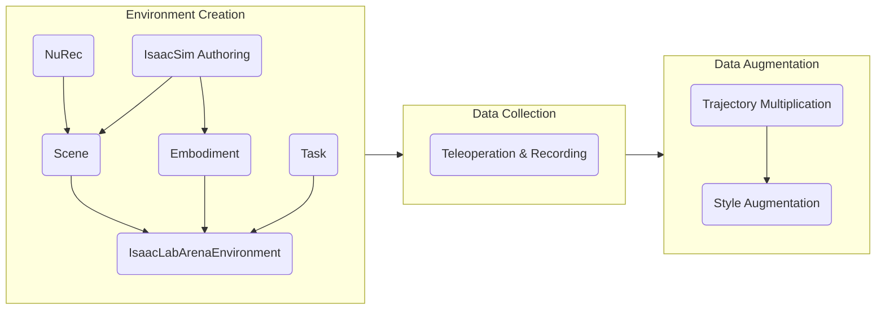
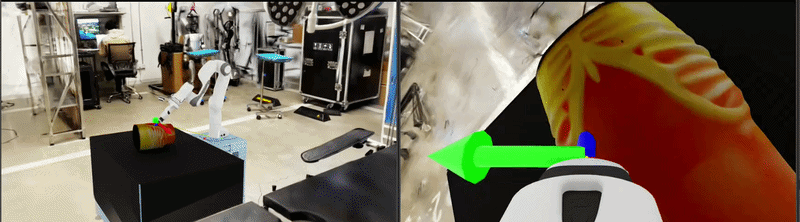

# Hospital Digital Twin

## The Goal

Hospitals are complex, high-stakes environments where robots could assist with repetitive
and physically demanding tasks — ultrasound scanning, surgical instrument handling, patient
monitoring, and more. Building robust robot capabilities for these settings requires large
amounts of high-quality demonstration data collected in simulation before deployment. The
foundation of this approach is a **digital twin**: a simulation that mirrors the
hospital workspace, the robot, and the task, so that data generated in simulation transfers
meaningfully to the real world.

This tutorial series walks through how to build a complete **hospital automation simulation
workflow** using NVIDIA's technology: from defining the physical environment, configuring a robot
embodiment, collecting human demonstrations, all the way to generating large synthetic
datasets for training and validation.

---

## The Pipeline



### Environment Creation

The environment is the digital twin of the hospital workspace. It is composed of three
independent pieces assembled together:

- **Scene** — the physical world: background room, furniture, and physics-enabled objects that can be randomised per episode. → [01 Scene Creation](./pages/01_scene_creation.md)
- **Embodiment** — the robot: joints, actuators, action space, observations, and reset behaviour. → [02 Embodiment](./pages/02_embodiment.md)
- **Task** — the objective: success condition, scene randomisation events, subtask signals for MimicGen, and metrics. → [03 Task Definition](./pages/03_task.md)

Once defined, they are assembled and compiled into a standard Gymnasium environment that
you can launch interactively to verify everything is in place before collecting data.
→ [04 Environment Launching](./pages/04_environment.md)

### Data Collection

A human operator drives the robot through the task using a teleoperation device —
keyboard, SpaceMouse, gamepad, or XR hand-tracking. Successful episodes are recorded as
HDF5 files containing the action sequence, observations, and initial simulation state.
A small set of demonstrations (10–50) is typically enough to seed the next stage.
→ [05 Teleoperation and Recording](./pages/05_teleop_recording.md)

### Data Augmentation

1. **MimicGen** takes the recorded trajectories and generates a much larger synthetic dataset
by transferring subtask segments to new object configurations — turning 10 human demos
into thousands of training episodes without additional human effort.
→ [06 Trajectory Multiplication](./pages/06_mimicgen.md)

2. **Cosmos-transfer**  applies visual domain randomisation —
varying lighting, textures, and camera characteristics — to produce datasets that are more
robust for sim-to-real transfer.
→ [Style Augmentation](./generate_photoreal_variants/cosmos_transfer2.5/README.md)

---

## Relevant Technologies

**Isaac Sim** is the physics and rendering engine. You use it to *author* assets — placing
meshes, configuring physics properties, lighting, and exporting USD files. It is the
right tool when you are building or inspecting a scene visually. [IsaacSim documentation](https://docs.isaacsim.omniverse.nvidia.com/5.1.0/index.html)

**IsaacLab** is the robot learning framework built on top of Isaac Sim. It provides
parallelised simulation environments, a manager-based architecture for actions, observations,
events, and terminations, and integrations with imitation learning tools like MimicGen.
You use IsaacLab when you are *training or collecting data*. [IsaacLab documentation](https://isaac-sim.github.io/IsaacLab/)

**IsaacLab Arena** sits on top of IsaacLab and provides a modular composition layer
specifically for hospital automation workflows. It introduces the concepts of **Scene**,
**Embodiment**, and **Task** as composable building blocks, plus utilities for teleoperation,
recording, and data augmentation.  [IsaacLab-Arena documentation](https://isaac-sim.github.io/IsaacLab-Arena/main/)

> A quick rule of thumb: use Isaac Sim to author assets, use IsaacLab/Arena to
> build the robotic application.

**NuRec** is a Real2Sim pipeline that converts real hospital environments into
simulation-ready USD assets by simply taking videos/photos around the environment. [NuRec documentation](./bring_your_own_or/reconstruct_or_from_video/README.md)

**MimicGen** is a data generation system that takes a small set of human demonstrations
and automatically transfers them to thousands of new object configurations.

**Cosmos-transfer** is a world foundation model used for visual domain randomisation — lighting, textures, camera noise — to make
synthetic datasets more robust for sim-to-real transfer. [Cosmos-transfer2.5 documentation](./generate_photoreal_variants/cosmos_transfer2.5/README.md)

---

## The Reference Workflow



This tutorial uses the **Franka ultrasound workflow** as reference example.
It consists of a Franka Panda arm fitted with an ultrasound probe operating in a hospital
room, completing a two-phase task:

1. **Reach** — bring the probe tip to a contact point on an abdominal phantom surface
2. **Scan** — slide the probe to a target scan endpoint

This workflow is simple enough to understand quickly but covers every part of the pipeline:
a Real2Sim hospital background, physics-enabled objects, a 6-DOF IK-controlled robot,
subtask-structured demonstrations, and MimicGen data generation.

The complete reference implementation lives in
[`ref_workflows/franka_ultrasound/`](./ref_workflows/franka_ultrasound/).

---

## Building Your Workflow

All of your workflow code lives inside the IsaacLab Arena source tree. The map below shows
every file you will touch, what action to take, and which tutorial section covers it.

```text
isaaclab_arena/
│
├── assets/
│   ├── asset.py                          ← EDIT  add USD path mappings         (01)
│   ├── background_library.py             ← EDIT  register your background       (01)
│   └── object_library.py                 ← EDIT  register your objects          (01)
│
├── embodiments/
│   ├── __init__.py                       ← EDIT  add one import line            (02)
│   └── <your_robot>/                     ← CREATE embodiment module             (02)
│       ├── __init__.py
│       └── <your_robot>.py
│
├── tasks/
│   └── <your_task>.py                    ← CREATE task definition               (03)
│
└── examples/example_environments/
    ├── cli.py                            ← EDIT  one import + one dict entry    (03)
    └── <your_environment>.py             ← CREATE environment assembly          (04)
```

For reference workflow, ready-to-copy snippets for each step are in
[`ref_workflows/franka_ultrasound/`](./ref_workflows/franka_ultrasound/).

---

## A Note for Developer

Currently, adding a new workflow requires editing a few files inside the IsaacLab Arena
source tree (as shown in the map above). This means your workflow code lives alongside the
framework code. We are aware this is not ideal —

For now, the cleanest approach is to work on a branch of your IsaacLab Arena fork and keep
your workflow additions isolated to the files listed above.

---

**Start here:** [00 — Installation](./pages/installation.md) · [01 — Scene Creation](./pages/01_scene_creation.md)
