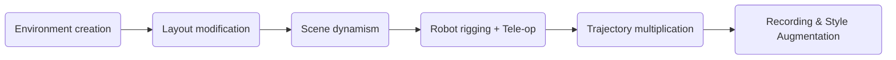

# Hospital Digital Twin (Bring your own hospital)

The Hospital Digital Twin pipeline turns real-world or authored environments into simulation-ready scenes with dynamic content, robot integration, and trajectory generation. This supports building healthcare simulations—training, teleoperation, or policy evaluation—using realistic hospital and operating room layouts. The result is reusable digital twins that integrate into Isaac Sim and downstream workflows such as MimicGen, SkillGen, and Cosmos.

## Pipeline Overview

The typical hospital digital twin pipeline flows from environment creation through layout and dynamism to robot rigging, trajectory multiplication, and recording:

## Available Components

1. **Environment Creation**
    - [Real2sim reconstruction (NuRec)](./bring_your_own_or/reconstruct_or_from_video/README.md) — Convert real-world photos or video into photorealistic 3D reconstructions (USDZ) for Isaac Sim.
    - [Assemble using sim-ready assets](./bring_your_own_or/setup_custom_operating_room/README.md) — Use pre-made OR and hospital assets (e.g., from the I4H Asset Catalog) and learn how to acquire or create 3D models of operating rooms.

2. **Layout Modification**
    - Adjust and refine the layout of your created or reconstructed environment (coming soon).

3. **Scene Dynamism**
    - Add dynamic elements, e.g. moving human agents (coming soon).

4. **Robot rigging + Tele-op**
    - [Bring Your Own Operating Room](./bring_your_own_or/setup_custom_operating_room/README.md) — Rig your own robot in Isaac Sim and operate it via teleoperation.
    - [Bring Your Own Robot](../robot_digital_twin/bring_your_own_robot/README.md) — Bring your own robot to the operating room
    - [Bring Your Own XR](./bring_your_own_xr/README.md) — OpenXR-based teleoperation (e.g., Apple Vision Pro with hand tracking).

5. **Trajectory Multiplication**
    - [Generate Robot Trajectories](./generate_robot_trajectories/README.md) — Generate or multiply trajectories for robot movements and skills

6. **Recording & Style Augmentation**
    - [Generate Photorealistic Variants](./generate_photoreal_variants/cosmos_transfer2.5/README.md) — Augment photo realism of the scene
