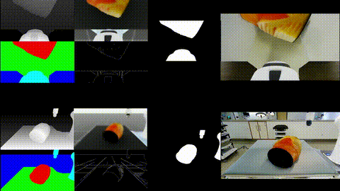

# Cosmos Transfer 2.5 Deployment & Workflow

Complete guide for deploying Cosmos Transfer 2.5 and running guided generation on robotic ultrasound data.

## Quick Start

### 0. Clone the Repository

Before running the setup, ensure you have installed and authenticated your [GitHub CLI](https://cli.github.com/) so it can access private repositories and avoid permission issues. Run the following command:

```bash
gh auth login
```

Follow the prompts to authenticate with your GitHub account—either by choosing HTTPS and pasting your authentication token, or by selecting the option to login with a web browser. This step is required before running setup scripts that use `gh repo clone` to access repositories.

```bash
gh repo clone isaac-for-healthcare/i4h-tutorials -- --branch maxo/ct25_tutorial --single-branch --depth 1
cd i4h-tutorials/synthetic-data-generation/cosmos_transfer2.5
```

### 1. Docker Setup (Optional — fresh cloud instances only)

**Skip this section if you are on an existing cluster.** It is intended for **newly provisioned cloud instances** (e.g. from [Brev](https://brev.nvidia.com/)), where Docker and caches may live on a small root volume. This step moves Docker and caches to the largest available drive so builds and runs don't run out of space.

**On an existing cluster:** do not run `01-system-setup.sh`. Instead:

1. Copy the environment template and set each path to match your cluster layout:

   ```bash
   cp .env.template .env
   # Edit .env and set every COSMOS_* variable (see table below).
   ```

2. Then continue with [§2. Guided Cosmos Setup](#2-guided-cosmos-setup) (`./02-guided_cosmos_2.5_setup.sh`).

**If you do run step 1 (fresh instance):** root permission is required.

```bash
sudo ./01-system-setup.sh
```

(~1 min). This creates `.env` with paths on the largest drive; you can still edit `.env` afterward if needed.

#### Environment variables (`.env` / `.env.template`)

| Variable | Purpose |
| -------- | ------- |
| `COSMOS_REPO_DIR` | Directory where the Cosmos Transfer 2.5 repo is (or will be) cloned; used as container workspace. |
| `COSMOS_HF_HOME` | Hugging Face cache for model downloads; mounted into the container. |
| `COSMOS_VENV_DIR` | Python virtualenv for the guided Transfer 2.5 environment. |
| `COSMOS_TORCH_HOME` | PyTorch cache directory. |
| `COSMOS_PIP_CACHE_DIR` | Pip download cache. |
| `COSMOS_ROBOTIC_US_DIR` | Directory for robotic ultrasound data (e.g. HDF5); mounted as `/workspace/robotic_us_example` in the container. |

### 2. Guided Cosmos Setup

This script puts caches and the repo on the largest drive (from step 1), clones the guided Cosmos Transfer 2.5 repo, builds the `guided-transfer2.5` Docker image, and writes the run script used in step 4.

```bash
./02-guided_cosmos_2.5_setup.sh
```

(~10-15 min)

### 3. Set HuggingFace Token

Required for the container to download Cosmos models from the Hub.

```bash
hf auth login
```

Get token from: <https://huggingface.co/settings/tokens>

### 4. Start Docker Container

Starts the `guided-transfer2.5` container (created in step 2). Use this whenever you want to run data preparation or guided generation.

```bash
./run_guided_transfer2.5_docker.sh
```

## Data Collection

> **⚠️ IMPORTANT:** This section is performed on a **SEPARATE SIMULATION MACHINE**, not the Cosmos Transfer machine.
>
> **Machine requirements:**
>
> - Isaac Sim environment
> - i4h-workflows Docker container
> - GPU-enabled system

For complete data collection instructions, including Docker setup, running the state machine, and understanding the collected data format, please refer to the [i4h-workflows Robotic Ultrasound Data Collection Guide](https://github.com/isaac-for-healthcare/i4h-workflows/blob/main/workflows/robotic_ultrasound/scripts/simulation/environments/state_machine/README.md#data-collection).

**We recommend following the dockerized setup tutorial in i4h-workflows** for the smoothest experience setting up the simulation environment.

### Try with sample data (no collection)

To try Cosmos Transfer 2.5 immediately without running the simulation or collecting data, download the provided sample data:

```bash
wget https://developer.download.nvidia.com/assets/Clara/i4h/cosmos_tutorials/sample_data.zip
unzip sample_data.zip
```

Place the unpacked data where the Data Preparation Pipeline expects it (e.g. under `/workspace/robotic_us_example/` on the Cosmos Transfer machine), then continue with [Data Preparation Pipeline](#data-preparation-pipeline) below.
The extracted zip folder contains the datafolders for each conversion step below.

### Transfer Data to Cosmos Machine (Optional)

If you are using Brev, after collection on the simulation machine, copy the HDF5 data directory to the Cosmos Transfer machine by:

```bash
# From simulation machine
brev copy /media/data/data/hdf5/YYYY-MM-DD-HH-MM-TASK_NAME/ \
    INSTANCE_NAME:/home/shadeform/robotic_us_example/

# Example:
brev copy /media/data/data/hdf5/2026-02-05-11-10-Isaac-Teleop-Torso-FrankaUsRs-IK-RL-Rel-v0/ \
    medical-cosmos-2-5-dc3f2e:/home/shadeform/robotic_us_example/
```

**Format:** `brev copy SOURCE_PATH INSTANCE_NAME:DEST_PATH`

Replace `INSTANCE_NAME` with your Cosmos machine's Brev instance name (visible in `brev ls`).

---

**✅ After transfer, continue with the Data Preparation Pipeline below on the Cosmos Transfer machine.**

## Data Preparation Pipeline

Run these steps **on the Cosmos Transfer machine**, inside the `guided-transfer2.5` container (from step 4). Ensure transferred HDF5 data is available under the mounted path (e.g. `/workspace/robotic_us_example/`).

### Input Parameters

**Text (1D):**

- The input string should be under 300 words and provide a detailed, descriptive script for world generation.
- Content may include the overall scene, important objects or characters, background elements, and specific actions or motions to occur within a 5-second clip.

**Video (3D):**

- Each frame should have a resolution of **1280×704** for 720P, or **832×480** for 480P models.

### Step 1: Convert HDF5 to Videos

Inside the `guided-transfer2.5` container:

```bash
cd /workspace/i4h-tutorials/synthetic-data-generation/cosmos_transfer2.5

# Dataset location (HDF5 export from simulation)
DATASET_DIR="2026-02-05-11-10-Isaac-Teleop-Torso-FrankaUsRs-IK-RL-Rel-v0"

# Install dependencies with pinned versions
uv pip install opencv-python==4.10.0.84 h5py==3.11.0 numpy==1.26.4

# Convert data (required for Cosmos Transfer 2.5)
python hdf5_to_video.py \
    --input_dir /workspace/robotic_us_example/$DATASET_DIR \
    --output_dir /workspace/robotic_us_example/$DATASET_DIR/videos \
    --upscale-720p
```

**What it does:**

- Converts HDF5 → MP4 videos (RGB, depth, segmentation)
- Saves camera parameters (intrinsics, extrinsics)
- Upscales to 1280x720 (Lanczos for RGB/depth, nearest neighbor for masks)
- Outputs `seg_masks.npz` for guided generation

### Step 2: Organize Data for Guided Generation

```bash
# Process all episodes (creates separate organized folders for each)
# Output defaults to parent of source directory
python organize_video_data.py \
    --source /workspace/robotic_us_example/$DATASET_DIR/videos

# Or specify output directory explicitly
python organize_video_data.py \
    --source /workspace/robotic_us_example/$DATASET_DIR/videos \
    --output /workspace/robotic_us_example

# Or process a single episode only
python organize_video_data.py \
    --source /workspace/robotic_us_example/$DATASET_DIR/videos \
    --episode data_0
```

**What it does:**

- **Creates separate organized folder for EACH episode** (no data mixing!)
- Renames files to expected names (`robotic_us_input.mp4`, etc.)
- Converts RGB masks → label masks (0-4) using hardcoded mapping
- Automatically resizes masks to 720p if videos are 720p
- Generates config JSONs for room + wrist cameras
- Creates default prompt text file

**Important:** If you collected multiple episodes (e.g., `data_0.hdf5`, `data_1.hdf5`), this script will create separate output folders for each:

- `robotic_us_organized_TIMESTAMP_data_0/`
- `robotic_us_organized_TIMESTAMP_data_1/`

**Output structure (per episode):**

```text
robotic_us_organized_TIMESTAMP_data_0/     # Episode 0
├── robotic_us_input.mp4                   # Room camera RGB
├── robotic_us_wrist_input.mp4             # Wrist camera RGB
├── robotic_us_prompt.txt                  # Generation prompt
├── depth/
│   ├── robotic_us_depth.mp4
│   └── robotic_us_wrist_depth.mp4
├── multicontrol/
│   ├── robotic_us_multicontrol_guided_spec.json
│   └── robotic_us_wrist_multicontrol_guided_spec.json
├── outputs/                               # Generation outputs saved here
├── robotic_us/
│   └── data_0/                            # Original files from this episode
└── seg/
    ├── robotic_us_seg.mp4
    ├── robotic_us_wrist_seg.mp4
    ├── robotic_us_mask.npz                # Binary mask for guided gen
    ├── robotic_us_wrist_mask.npz
    ├── room_camera_para.npz
    └── wrist_camera_para.npz
```

## Running Guided Generation

All commands in this section run **inside the `guided-transfer2.5` container**. Use a data directory from the organized output of Step 2 (e.g. `robotic_us_organized_*_data_0`).

### Setup Data Directory

```bash
# Set your organized data directory (change timestamp/episode as needed)
export DATA_DIR=/workspace/robotic_us_example/robotic_us_organized_TIMESTAMP_data_0

# Verify it exists
ls $DATA_DIR/multicontrol/
```

### Single Camera

```bash
cd /workspace

# Room camera
python examples/inference.py \
  -i $DATA_DIR/multicontrol/robotic_us_multicontrol_guided_spec.json \
  --output_dir $DATA_DIR/outputs

# Wrist camera
python examples/inference.py \
  -i $DATA_DIR/multicontrol/robotic_us_wrist_multicontrol_guided_spec.json \
  --output_dir $DATA_DIR/outputs
```

### Multi-GPU Parallel

```bash
cd /workspace

# Run both cameras in parallel
CUDA_VISIBLE_DEVICES=0 python examples/inference.py \
  -i $DATA_DIR/multicontrol/robotic_us_multicontrol_guided_spec.json \
  --output_dir $DATA_DIR/outputs &

CUDA_VISIBLE_DEVICES=1 python examples/inference.py \
  -i $DATA_DIR/multicontrol/robotic_us_wrist_multicontrol_guided_spec.json \
  --output_dir $DATA_DIR/outputs &

wait
```

### Context-Parallel Execution (8 GPUs)

**Context parallelism** splits the model or sequence across multiple GPUs so a single run can use more memory and compute. Unlike launching separate processes per camera, `torchrun` spawns one process per GPU and coordinates them; the script can then shard activations or batch dimensions across devices to handle longer contexts or larger batches than fit on one GPU.

```bash
cd /workspace

torchrun --nproc_per_node=8 --master_port=29500 \
  examples/inference.py \
  -i $DATA_DIR/multicontrol/robotic_us_multicontrol_guided_spec.json \
  -o $DATA_DIR/outputs
```

Generated videos are written to `$DATA_DIR/outputs/`.

**Reminder:**

If you are using Brev, copy generated data from the Cosmos machine to your host PC so you don't lose it when the instance is stopped. Use `brev copy` in the opposite direction:

```bash
brev copy INSTANCE_NAME:REMOTE_PATH LOCAL_PATH

# Example:
brev copy medical-cosmos-2-5-dc3f2e:/home/shadeform/robotic_us_example/robotic_us_organized_*_data_0/outputs/ ./local_outputs/
```

## Key Config Parameters

Edit the JSON config files in `$DATA_DIR/multicontrol/` to adjust generation. (Some editors may complain about `//` comments in JSON; you can remove them.)

```json
{
  "guided_generation_mask": "../seg/robotic_us_mask.npz",
  "guided_generation_step_threshold": 25,
  "guided_generation_foreground_labels": [2, 4],
  "guidance": 3,
  "depth": { "control_weight": 0.5 },
  "seg": { "control_weight": 0.5 }
}
```

- `guided_generation_step_threshold`: 15–30; higher = more preservation of input
- `guided_generation_foreground_labels`: which labels to preserve (default Blue=2, Yellow=4)
- `guidance`: CFG scale
- `depth.control_weight` / `seg.control_weight`: strength of depth and segmentation guidance

**guided_generation_step_threshold** (e.g. 25): Controls how many denoising steps use the input conditioning. **Lower** (15–20): model has more freedom earlier → more creative change, possible drift or inconsistency. **Higher** (25–30): input is respected longer → output stays closer to source, less “hallucination.” If results look too different from your video, increase; if they look too rigid or artifacted, decrease.

**guidance** (e.g. 3): Classifier-free guidance (CFG) scale—how strongly the model follows the text prompt. **Lower** (2–2.5): softer adherence to prompt, more natural but may ignore parts of the prompt. **Higher** (3.5–5): stronger prompt following, can look oversaturated or “pushed.” Tune up if the model ignores the prompt; tune down if the video looks overprocessed or unstable.

**guided_generation_foreground_labels:**

- Default: `[2, 4]` (Blue and Yellow labels)
- Color mapping: Black(0)=bg, Red(1), Blue(2), Green(3), Yellow(4)
- Only specified labels are preserved from input video
- Other regions regenerated based on prompt
- To preserve all labels, use `[1, 2, 3, 4]`

## Example Results



The GIF above shows **example results** from guided generation:

- **Conditioning inputs:** All inputs that can be used for conditioning (e.g.depth, vis, semantic segmentation, edge). These can be controlled by adjusting the weights in the created inference config. The weights should sum to one.
- **Final mask:** The mask after applying the masking used for latent conditioning (only foreground labels in `guided_generation_foreground_labels` are preserved). In this case we used the foreground labels [2, 4] which correspond to the robotic arm and the phantom.
- **Two views:** Each view was generated with a **different text prompt**; the same conditioning can yield different styles or narratives depending on the prompt.

### Writing good prompts for video generation models

- **Be specific about motion and timing:** e.g. "slow pan", "static camera", "smooth probe motion" so the model doesn’t invent unwanted motion.
- **Describe the scene and style first:** e.g. "clinical ultrasound exam", "realistic tissue", "clean procedural video" to anchor appearance before adding actions.
- **Match the mask semantics:** Describe what the preserved regions represent (e.g. "ultrasound probe", "anatomy") so the model aligns the prompt with the masked content.
- **Prefer short, concrete phrases:** Long sentences often dilute control; 1–2 clear clauses usually work better than paragraphs.
- **Iterate on failure modes:** If you get drift, artifacts, or wrong motion, narrow the prompt (e.g. add "stable", "no flicker") or simplify it.

## Docker Utilities

### Attach to Running Container

From the host, from the directory where you cloned this repo (e.g. `.../i4h-tutorials/synthetic-data-generation/cosmos_transfer2.5`):

```bash
./03-attach_guided_transfer2.5_docker.sh
```

### Mounted Directories

Inside container:

- `/workspace/i4h-tutorials/` → Host tutorials repo
- `/workspace/robotic_us_example/` → Host data directory
- `/workspace/guided-cosmos-transfer2.5/` → Cosmos repo

Files saved in mounted dirs persist on host.
