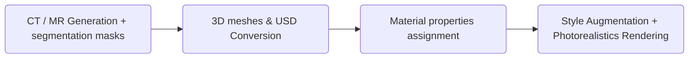

# Patient Digital Twin (Bring your own patient)

The Patient Digital Twin pipeline turns clinical data (imaging, physiological) into simulation-ready 3D assets in Universal Scene Description (USD) format. This lets you build and run healthcare simulations—surgical planning, training, or AI policy evaluation—using anatomically accurate, synthetic patient representations instead of real patient data. The result is reusable, privacy-safe digital twins that integrate into Isaac Sim and downstream rendering or domain-randomization workflows.

## Pipeline Overview

The typical synthetic data generation pipeline flows from medical imaging and segmentation through 3D conversion to photorealistic rendering:

## Available Components

1. **CT / MR Generation + segmentation masks**
    - [Generate imaging data and segmentation masks with NV-Generate](./generate_synthetic_medical_images/README.md)

2. **3D meshes & USD Conversion**
    - [Convert CT/MR to 3D meshes as Universal Scene Description (USD) using MONAI](./convert_medical_images_to_USD/convert_CT_MR_to_USD_with_MONAI/README.md)
    - [Convert CT to 3D meshes as Universal Scene Description (USD) using local tools](./convert_medical_images_to_USD/convert_CT_to_USD/README.md)

3. **Material properties assignment**
    - Define textures and material properties on the USD assets (coming soon)

4. **Style Augmentation + Photoreal Rendering** (Cosmos-H-Surgical-Transfer)
    - [Apply style augmentation and photorealistic rendering](https://github.com/NVIDIA-Medtech/Cosmos-H-Surgical/tree/main/transfer)
