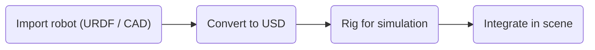

# Robot Digital Twin (Bring your own robot)

The Robot Digital Twin pipeline turns your robot descriptions (URDF, CAD) into simulation-ready articulated assets in Universal Scene Description (USD) format. This lets you integrate custom robots—surgical arms, mobile platforms, or instrumented end-effectors—into Isaac Sim for teleoperation, trajectory generation, and policy evaluation alongside the [Hospital](../hospital_digital_twin/) and [Patient](../patient_digital_twin/) digital twin pipelines.

## Pipeline Overview

The typical robot digital twin workflow flows from importing your robot definition through USD conversion and physics rigging to integration in a scene:

## Available Components

1. **Bring your own robot**
    - [Bring Your Own Robot](./bring_your_own_robot/README.md) — Import custom robots from URDF or CAD, convert to USD, and rig them in Isaac Sim (collision meshes, joints, articulation root). Includes a step-by-step example for replacing the Franka hand with an ultrasound probe for robotic ultrasound scanning.

For environment setup, robot rigging in an operating room, and teleoperation (e.g. OpenXR), see the [Hospital Digital Twin](../hospital_digital_twin/) pipeline.
