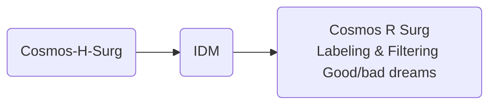
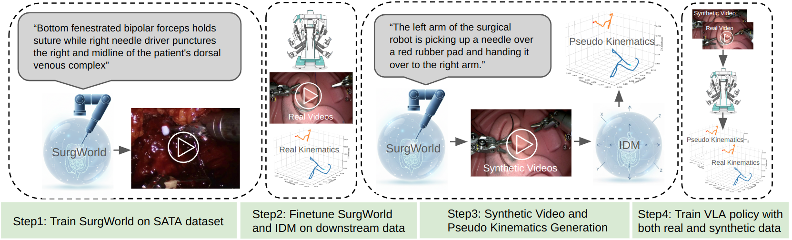
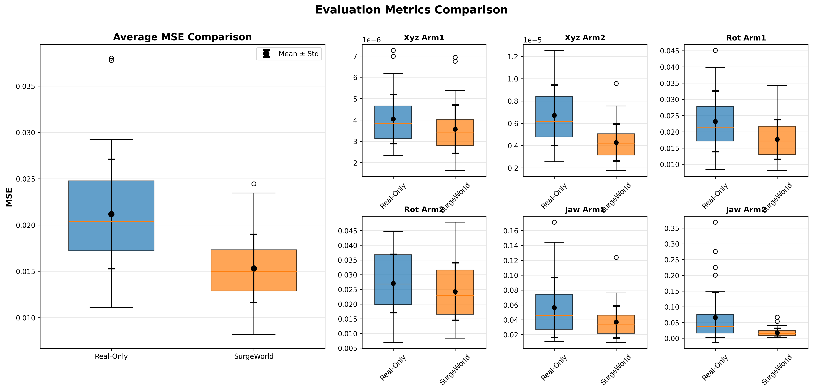
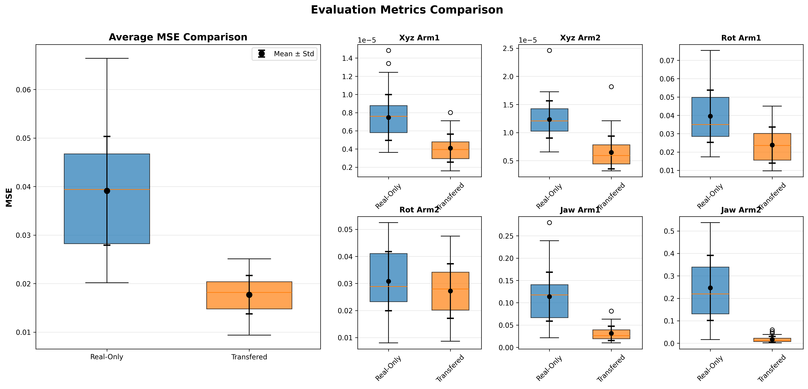

# Surgical Robotic Video Generator

This tutorial bridges the Cosmos-H-Surgical-Predict world model with downstream robotic policy using an Inverse Dynamic Model (IDM), and uses Cosmos-H-Surgical-Transfer to augment training data. The technique is described in the [SurgWorld paper](https://arxiv.org/abs/2512.23162).

## Pipeline Overview

The pipeline flows from world-model rollout through inverse dynamics to policy training with labeling and filtering:



## Available Components

1. **Cosmos-H-Surg**
    - Finetune the Cosmos-H-Surgical-Predict world model on downstream kinematics (optional) and generate video rollouts from initial frames. See [Step1: World Model Finetuning and Rollout](#step1-world-model-finetuning-and-rollout) and the [Cosmos-H-Surgical-Predict](https://github.com/NVIDIA-Medtech/Cosmos-H-Surgical/blob/main/predict/README.md) repo.

2. **IDM**
    - Train an Inverse Dynamic Model on paired video-kinematic data to generate kinematics from world-model rollouts. See [Step2: Inverse Dynamic Model training](#step2-inverse-dynamic-model-training) and [Downstream video-kinematic paired data](#downstream-video-kinematic-paired-data).

3. **Cosmos R Surg — Labeling & Filtering Good/bad dreams**
    - Use the rollouts and IDM-generated kinematics for GR00T VLA policy training, with labeling and filtering of good/bad dreams. See [Step3: GR00T VLA policy training](#step3-gr00t-vla-policy-training). For style augmentation and transfer, see [Cosmos-H-Surgical-Transfer](https://github.com/NVIDIA-Medtech/Cosmos-H-Surgical/tree/main/transfer).

---

This tutorial covers two part:

1. How to bridge the Cosmos-H-Surgical-Predict world model with downstream robotic policy using inverse kinematic models. The technique is described in detail in [SurgWorld paper](https://arxiv.org/abs/2512.23162)



1. How to use the Cosmos-H-Surgical-Transfer model to augment the training data and improve the downstream policy generalizability

## 1. Cosmos-H-Surgical-Predict with IDM Tutorial

## Downstream video-kinematic paired data

- (A). Downstream kinematics training split data for the task: hdf5 files
- (B). Downstream kinematics testing split data for the task: hdf5 files
- (C). Downstream kinematics data of the same embodiment, not necessarily the same task (optional, used to improve IDM performance): hdf5 file
- (D). Initial Frames for new video generation.

## Step1: World Model Finetuning and Rollout

- Finetune world model on Downstream kinematics data for the task (optional)
- Generate new video rollouts based on initial frames

## Step2: Inverse Dynamic Model training

- Finetune IDM on A + B datasets
- (E). Generate Kinematics for the world model video rollouts

## Step3: GR00T VLA policy training

- Baseline VLA training on (A), test on (B)
- Baseline VLA traiining on (D) then finetune on (A), test on (B)

## Installation

```bash
export HOME=<mypath>/i4h-tutorials/synthetic-data-generation/surgical_robotic_video_generator
```

## 1.1. Lerobot V2 Installation

```bash
# Lerobot V2 conda env
# GR00T requires lerobot V2 format. We checkout an old lerobot version to directly curate V2 datasets
# User can also follow the GR00T repo instructions to use lerobot V3 format then convert back to V2.
cd $HOME
git clone https://github.com/huggingface/lerobot.git && cd lerobot && git checkout 1c0ac8e3
cd lerobot
conda create -y -n lerobot python=3.10
conda activate lerobot
apt update
apt install -y libgl1
pip install simplejpeg
conda install ffmpeg=7.1.1 -c conda-forge
pip install -e .
# Set Lerobot home directory to save converted lerobot dataset
export HF_LEROBOT_HOME=$HOME/dataset
```

## 1.2. GR00T N1.5 Installation

```bash
cd $HOME
git clone --branch n1.5-release --recurse-submodules https://github.com/NVIDIA/Isaac-GR00T.git
conda create -y -n gr00t python=3.10
conda activate gr00t
cd ./Isaac-GR00T
apt update -y && apt install -y libgl1
pip install --upgrade setuptools
pip install -e .[base]
pip install --no-build-isolation flash-attn==2.7.1.post4
# Update your wandb and huggingface api keys.
export WANDB_API_KEY=YOUR_WANDB_KEY
export HF_TOKEN=YOUR_HF_KEY
# Add medbot data config
cp $HOME/scripts/Isaac-GR00T/data_config.py $HOME/Isaac-GR00T/gr00t/experiment/data_config.py
# Add more detailed evaluation scripts for MSE evaluation
cp $HOME/scripts/Isaac-GR00T/eval.py $HOME/Isaac-GR00T/gr00t/utils/eval.py
cp $HOME/scripts/Isaac-GR00T/eval_policy.py $HOME/Isaac-GR00T/scripts/eval_policy.py
```

## 1.3. GR00T-Dream Installation

```bash
conda create --name gr00t_dream --clone gr00t
conda activate gr00t_dream
cd $HOME
git clone https://github.com/NVIDIA/GR00T-Dreams.git GR00T-Dreams && cd GR00T-Dreams && git checkout ec3881d44545016871997f8e17dd15f1d792e91d
pip install -e . --no-deps
# Convert mp4 files to lerobot
cp $HOME/scripts/GR00T-Dreams/mp4_to_lerobot_medbot.py $HOME/GR00T-Dreams/scripts/mp4_to_lerobot_medbot.py
# IDM inference scripts for converted lerobot
cp $HOME/scripts/GR00T-Dreams/idm_inference_simple.py $HOME/GR00T-Dreams/scripts/idm_inference_simple.py
# Add medbot dataconfig
cp $HOME/scripts/GR00T-Dreams/data_config_idm.py $HOME/GR00T-Dreams/scripts/data_config_idm.py
# Add torchvision backend
cp $HOME/scripts/GR00T-Dreams/video.py $HOME/GR00T-Dreams/gr00t/utils/video.py
# Update training to enable loading pretrained huggingface checkpoint
cp $HOME/scripts/GR00T-Dreams/idm_training.py $HOME/GR00T-Dreams/scripts/idm_training.py
```

## 1.4. Dataset download

```bash
wget -P $HOME/dataset/downstream <URL-TO-BE-UPLOADED>  # Download hdf5 files and save to ./dataset/downstream
```

## 1.5. Dataset Conversion

```bash
cd $HOME
# Training data for a certain task
python scripts/convert_data_medbot.py \
    --data_dir ./dataset/ \
    --split_file ./dataset/data_split.json \
    --splits train_A \
    --repo_id train_lerobot
cp ./dataset/modality.json ./dataset/train_lerobot/meta

# Adding data from the same embodiment, not necessarily doing the same task, to train the IDM.
# For simplicity, we add
python scripts/convert_data_medbot.py \
    --data_dir ./dataset/ \
    --split_file ./dataset/data_split.json \
    --splits train_A train_C \
    --repo_id train_idm_lerobot
cp ./dataset/modality.json ./dataset/train_idm_lerobot/meta

python scripts/convert_data_medbot.py \
    --data_dir ./dataset/ \
    --split_file ./dataset/data_split.json \
    --splits test_B \
    --repo_id test_lerobot
cp ./dataset/modality.json ./dataset/test_lerobot/meta
```

## 2. Train IDM models

```bash
cd $HOME/GR00T-Dreams
# Train the IDM model by finetuning the pretrained model.
OUTPUT=example_idm
python scripts/idm_training.py \
    --output_dir $OUTPUT \
    --dataset-path $HOME/dataset/train_idm_lerobot \
    --data-config medbot \
    --embodiment-tag new_embodiment \
    --video-backend torchvision_av \
    --pretrained-checkpoint seonghyeonye/IDM_franka \
    --learning_rate 1e-4 \
    --max-steps 10000

# Optional: illustrating IDM accuracy on test set. You can use this script to see if the IDM is achieving meaning accuracy.
python scripts/idm_inference_simple.py \
    --checkpoint $OUTPUT/checkpoint-10000 \
    --dataset  $HOME/dataset/test_lerobot \
    --output-dir $OUTPUT\
    --data-config medbot \
    --embodiment-tag new_embodiment \
    --batch-size 16 \
    --observation-indices 0 8;
```

## 3. Surgical World Model Rollouts (Optional)

User can skip this section by downloadingthe generated videos. Otherwise users need to follow instructions in [Cosmos-H-Surgical-Predict](https://github.com/NVIDIA-Medtech/Cosmos-H-Surgical/blob/main/predict/README.md).

```bash
# Skip this section by directly downloading the final rollouts.
mkdir -p $HOME/dataset/rollout && \
wget -P $HOME/dataset/rollout https://developer.download.nvidia.cn/assets/Clara/i4h/dream/rollout.zip && \
unzip $HOME/dataset/rollout/rollout.zip -d $HOME/dataset/rollout && \
rm $HOME/dataset/rollout/rollout.zip
```

The [Cosmos-H-Surgical-Predict](https://github.com/NVIDIA-Medtech/Cosmos-H-Surgical/blob/main/predict/README.md) is used to generate synthetic video rollouts. To generate downstream rollouts, we need to

1. LoRA finetune the base Cosmos-H-Surgical-Predict model on downstream task videos.
2. Obtain initial frames for rollout
3. Perform video rollouts based on text description and initial frame.

### 3.1 Prepare mp4 files for finetuning

```bash
cd $HOME
conda activate lerobot
python scripts/extract_frames_videos.py \
    --data_dir ./dataset/ \
    --split_file ./dataset/data_split.json \
    --splits train_A \
    --output_dir ./dataset/finetune_videos/ \
    --mode video \
    --camera_key cam_high \
    --fps 30
```

### 3.2 LoRA finetune base model

Follow the [instruction](https://github.com/NVIDIA-Medtech/Cosmos-H-Surgical/blob/main/predict/docs/setup.md) for installation and [instruction](https://github.com/NVIDIA-Medtech/Cosmos-H-Surgical/blob/main/predict/docs/post-training_cosmos_h_surgical_assets_lora.md) for LoRA finetuning.  Use the extracted MP4 files saved in `./dataset/finetune_videos/`.

### 3.3 Prepare initial frame and perform video rollouts

```bash
cd $HOME
# extract initial frames. Initial frames should be provided in different downstream tasks.
python scripts/extract_frames_videos.py \
    --data_dir ./dataset/ \
    --split_file ./dataset/data_split.json \
    --splits train_C \
    --output_dir ./dataset/rollout_initial_frame/ \
    --mode frame \
    --camera_key cam_high
```

Follow the [instruction](https://github.com/NVIDIA-Medtech/Cosmos-H-Surgical/blob/main/predict/docs/post-training_cosmos_h_surgical_assets_lora.md#3-inference-with-lora-post-trained-checkpoint) for inference using pretrained LoRA checkpoint. Use the initial frames generated in `./dataset/rollout_initial_frame/` and text description `phantom surgery scene: Use left robotic forceps to pick up a needle and pass to right robotic forceps`

## 4. Labeling video rollouts with IDM and convert to Lerobot format

```bash
cd $HOME/GR00T-Dreams/

echo '[INFO] Converting MP4 videos to Lerobot dataset format...'
conda activate lerobot
MP4_FOLDER=$HOME/dataset/rollout/
IDM_CHECKPOINT=./example_idm/checkpoint-1000
IDM_STATS=$HOME/dataset/train_idm_lerobot/meta/stats.json
OUTPUT_DIR=$HOME/dataset/rollout_lerobot
python scripts/mp4_to_lerobot_medbot.py \
        --video-dir $MP4_FOLDER \
        --output-dir $OUTPUT_DIR \
        --task-description 'The left arm of the surgical robot is picking up a needle over a red rubber pad and handing it over to the right arm.' \
        --fps 16

echo '[INFO] Copying IDM stats metadata...'
mkdir -p $OUTPUT_DIR/meta
# Copy the dataset stats to from training data to the inference mp4 data.
cp $IDM_STATS $OUTPUT_DIR/meta/stats.json
cp $HOME/dataset/modality.json $OUTPUT_DIR/meta

echo '[INFO] IDM inference'
conda activate gr00t_dream
python scripts/idm_inference_simple.py \
    --checkpoint $IDM_CHECKPOINT \
    --dataset $OUTPUT_DIR \
    --output-dir $OUTPUT_DIR \
    --data-config medbot \
    --embodiment-tag new_embodiment \
    --video-backend torchvision_av \
    --batch-size 16 \
    --observation-indices 0 8 \
    --update-dataset
```

## 5. Training GR00T-N1.5 VLA policy

## 5.1. Training Base Policy from Real only

```bash
conda activate gr00t
cd $HOME/Isaac-GR00T
python scripts/gr00t_finetune.py \
    --dataset-path $HOME/dataset/train_lerobot \
    --num-gpus 8 \
    --video-backend torchvision_av \
    --data-config medbot \
    --embodiment_tag new_embodiment \
    --max_steps 200 \
    --save_steps 50 \
    --output-dir ./ckpt/base_real \
    --batch_size 16

# --- Evaluation ---
conda activate gr00t
cd $HOME/Isaac-GR00T
python scripts/eval_policy.py --plot \
    --dataset-path $HOME/dataset/test_lerobot \
    --embodiment-tag new_embodiment \
    --data-config medbot \
    --save_plot_path ./ckpt/base_real/eval.png \
    --model_path ./ckpt/base_real/checkpoint-200 \
    --action_horizon 16 \
    --video-backend torchvision_av
```

## 5.2. Training Policy with Generated and Real video

```bash
echo "[INFO] Running SYN_DATA pretraining..."
conda activate gr00t
cd $HOME/Isaac-GR00T
python scripts/gr00t_finetune.py \
    --dataset-path $HOME/dataset/rollout_lerobot \
    --num-gpus 8 \
    --video-backend torchvision_av \
    --data-config medbot \
    --embodiment_tag new_embodiment \
    --output-dir ./ckpt/base_syn \
    --batch_size 16 \
    --max_steps 200 \
    --save_steps 50
# --- Fine-tuning on FT_DATA ---
conda activate gr00t
cd $HOME/Isaac-GR00T
python scripts/gr00t_finetune.py \
    --dataset-path $HOME/dataset/train_lerobot \
    --num-gpus 8 \
    --video-backend torchvision_av \
    --data-config medbot \
    --base-model-path ./ckpt/base_syn/checkpoint-200 \
    --learning_rate 2e-5 \
    --embodiment_tag new_embodiment \
    --max_steps 200 \
    --save_steps 50 \
    --output-dir ./ckpt/ft_syn \
    --batch_size 16
# --- Evaluation ---
conda activate gr00t
cd $HOME/Isaac-GR00T
python scripts/eval_policy.py --plot \
    --dataset-path $HOME/dataset/test_lerobot \
    --embodiment-tag new_embodiment \
    --data-config medbot \
    --save_plot_path ./ckpt/ft_syn/eval.png \
    --model_path ./ckpt/ft_syn/checkpoint-200 \
    --action_horizon 16 \
    --video-backend torchvision_av
```

## 5.3. Comparison with box plots

```bash
cd $HOME
python scripts/plot_eval.py $HOME/Isaac-GR00T/ckpt/base_real/eval.json $HOME/Isaac-GR00T/ckpt/ft_syn/eval.json "Real-Only" "SurgeWorld" --output comparison.png
```



## 6. Cosmos-H-Surgical-Transfer Tutorial

The purpose of transfer is to do data augmentation such that the downstream policy can show better generalizability. We reuse the dataset with kinematics and transfer them from out side body to inside body.

## Downstream video-kinematic paired data (Transfer)

- (A). Downstream kinematics training split data for the task: hdf5 files -> transfer videos
- (B). Downstream kinematics testing split data for the task: hdf5 files -> transfer videos
The test split has been transferred from outside-body to inside-body. This is used to simulate out-of-domain test cases. Users can prepare any test dataset. Cosmos-H-Surgical-Transfer is not required for test data curation.
The training split has been transferred from outside-body to inside-body. This is showcasing how to perform data augmentation of training data to make VLA policy generalizable.

## 6.1. Installation

Follow section 1.2 to install GR00T N1.5 conda environments.

```bash
export HOME=/home/users/yufanh/Dream-Tutorial/
cd $HOME
# use the preinstalled gr00t conda env.
conda activate gr00t
apt update
apt install -y libgl1
pip install simplejpeg
conda install ffmpeg=7.1.1 -c conda-forge
```

## 6.2. Transfer datasets (Optional)

User can skip this section by downloadingthe transferred videos. Otherwise users need to follow instructions in [Cosmos-H-Surgical-Transfer](https://github.com/NVIDIA-Medtech/Cosmos-H-Surgical/tree/main/transfer).

```bash
# Skip this section by directly downloading the final rollouts.
mkdir -p $HOME/dataset/transferred && \
wget -P $HOME/dataset/transferred https://developer.download.nvidia.cn/assets/Clara/i4h/dream/transferred.zip && \
unzip $HOME/dataset/transferred/transferred.zip -d $HOME/dataset/transferred && \
rm $HOME/dataset/transferred/transferred.zip
```

User needs to perform cosmos transfer to the datasets using
Follow [instruction](https://github.com/NVIDIA-Medtech/Cosmos-H-Surgical/blob/main/transfer/docs/setup.md) for setup.

For inference. Users will need the `mp4 video file`, `segmentation masks`, and `text descriptions`.

```bash
# generate mp4 files
cd $HOME
conda activate lerobot
python scripts/extract_frames_videos.py \
    --data_dir ./dataset/ \
    --split_file ./dataset/data_split.json \
    --splits train_C test_B \
    --output_dir ./dataset/to_be_transferred/ \
    --mode video \
    --camera_key cam_high \
    --fps 30
```

```bash
# Download the segmentation mask, which is generated using SAM2
mkdir -p $HOME/dataset/to_be_transferred_mask && \
wget -P $HOME/dataset/to_be_transferred_mask https://developer.download.nvidia.cn/assets/Clara/i4h/dream/to_be_transferred_mask.zip && \
unzip $HOME/dataset/to_be_transferred_mask/to_be_transferred_mask.zip -d $HOME/dataset/to_be_transferred_mask && \
rm $HOME/dataset/to_be_transferred_mask/to_be_transferred_mask.zip
```

Use the text description `real surgery scene: Use left robotic forceps to pick up a needle and pass to right robotic forceps`.
Finally, follow [instruction](https://github.com/NVIDIA-Medtech/Cosmos-H-Surgical/blob/main/transfer/docs/inference.md) to perform transfer and save results to `./dataset/transferred`

## 6.3 Convert video back into LeRobot V2 format

```bash
python scripts/replace_video.py \
    --data_dir ./dataset/ \
    --split_file ./dataset/data_split.json \
    --splits test_B \
    --repo_id test_lerobot \
    --new_repo_id test_lerobot_transferred \
    --transferred_video_path ./dataset/transferred

python scripts/replace_video.py \
    --data_dir ./dataset/ \
    --split_file ./dataset/data_split.json \
    --splits train_A \
    --repo_id train_lerobot \
    --new_repo_id train_lerobot_transferred \
    --transferred_video_path ./dataset/transferred
```

## 6.4. Training GR00T-N1.5 base model on the transferred dataset

```bash
conda activate gr00t
cd $HOME/Isaac-GR00T
python scripts/gr00t_finetune.py \
    --dataset-path $HOME/dataset/train_lerobot_transferred \
    --num-gpus 7 \
    --video-backend torchvision_av \
    --data-config medbot \
    --embodiment_tag new_embodiment \
    --max_steps 200 \
    --save_steps 50 \
    --output-dir ./ckpt/base_real_transfer \
    --batch_size 16
```

## 5.3. Evaluation and Comparison with box plots

```bash
# --- Evaluation ---
conda activate gr00t
cd $HOME/Isaac-GR00T
python scripts/eval_policy.py --plot \
    --dataset-path $HOME/dataset/test_lerobot_transferred \
    --embodiment-tag new_embodiment \
    --data-config medbot \
    --save_plot_path ./ckpt/base_real_transfer/eval.png \
    --model_path ./ckpt/base_real_transfer/checkpoint-200 \
    --action_horizon 16 \
    --video-backend torchvision_av

# --- Base model Evaluation ---
conda activate gr00t
cd $HOME/Isaac-GR00T
python scripts/eval_policy.py --plot \
    --dataset-path $HOME/dataset/test_lerobot_transferred \
    --embodiment-tag new_embodiment \
    --data-config medbot \
    --save_plot_path ./ckpt/base_real/eval_transfer.png \
    --model_path ./ckpt/base_real/checkpoint-200 \
    --action_horizon 16 \
    --video-backend torchvision_av

## Box plots
cd $HOME
python scripts/plot_eval.py $HOME/Isaac-GR00T/ckpt/base_real/eval_transfer.json $HOME/Isaac-GR00T/ckpt/base_real_transfer/eval.json "Real-Only" "Transferred" --output comparison_transfer.png
```


